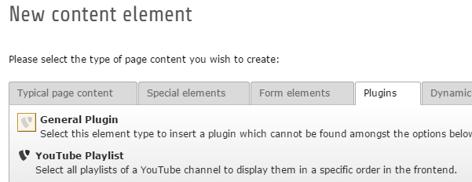
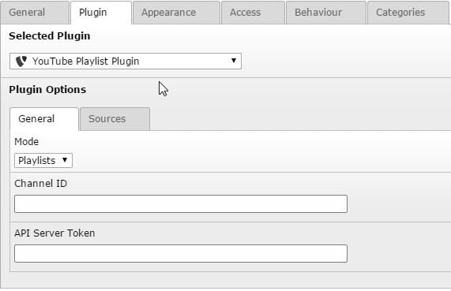
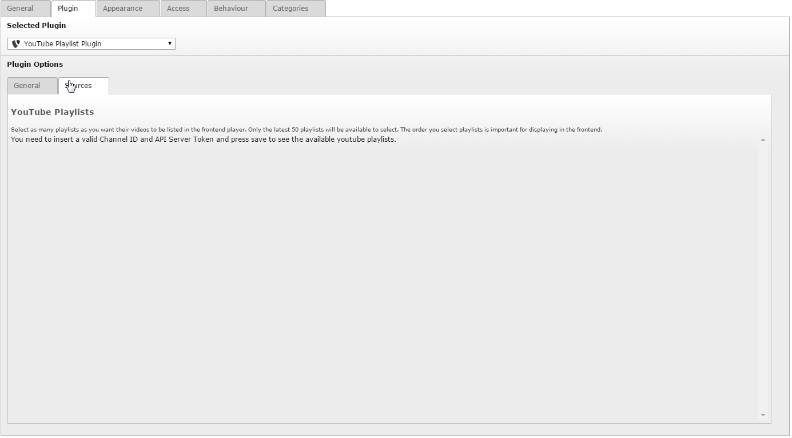
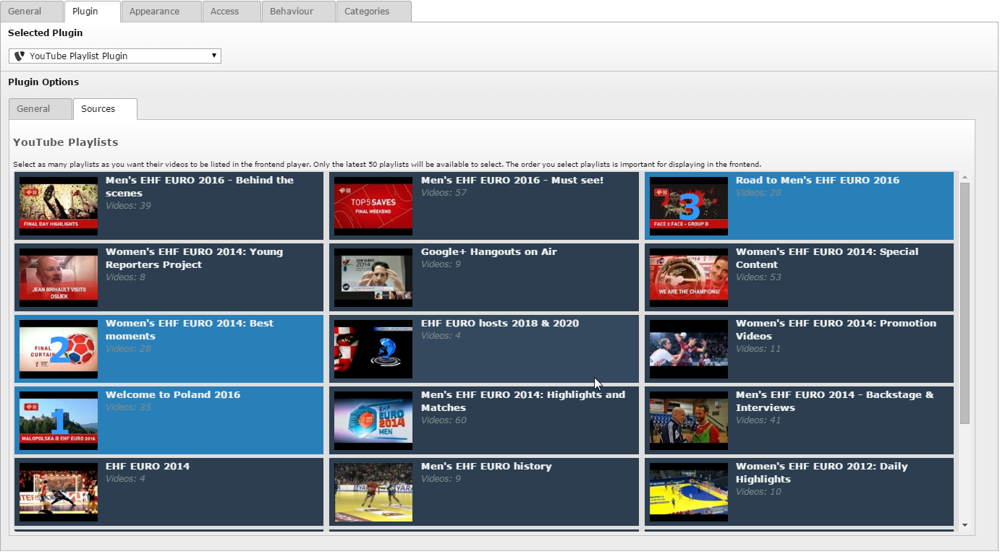
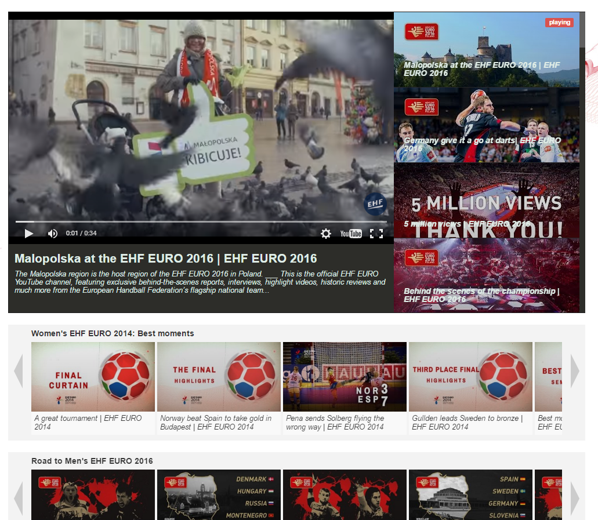

.. ==================================================
.. FOR YOUR INFORMATION
.. --------------------------------------------------
.. -*- coding: utf-8 -*- with BOM.

.. include:: ../Includes.txt

.. _users-manual:

Users manual
============

Installation
------------
To install just download the extension from TER or composer. No extension configuration needed.

Usage
-----
To include the plugin on your page you need to add it as a "New content element" in the tab "Plugins".

In the plugin configuration you need to set a mode. Currently there is only playlist mode available because I don't know which mode could be relevant aswell. Also it is reqiured to set the Channel ID to an ID of a channel you want to get the playlists from. The API Server Token is crucial for the plugin to work. If you don't fill it, you wont be able to display any playlist. This is due to Google's policy of using the API. To create an API Server Token you need to go to the Google Developer Console (https://console.developers.google.com/apis/). In the API section you have to create an YouTube Data Token. Remember that these tokens have daily limits. The current limit (2016) is 50.000.000 requests per day. Quotas as following:

- every playlist cost **3**
- every video in a playlist cost **5**

If you see this "Source" screen you forgot to enter a proper Channel ID or API Server Token.

If everything is valid it should look like this:

As you got all your channel playlists listed you can select as many as you want to be displayed in the frontend. Remember that only the last **50** playlists will be requested out of the channel. The order you pick the playlistitems is the order they will displayed in the frontend view. To stay aware of the order large number are shown on the playlist thumbnails. You are free to select and deselect any item you want. The order will stay the same.

FrontEnd
---------

This is how it will look like in the frontend. The first playlist is always in the large showcase at the top. All further playlists will be at the bottom each in it's own row.

Link to official documentation
------------------------------

If you need more info just visit the github repository.

